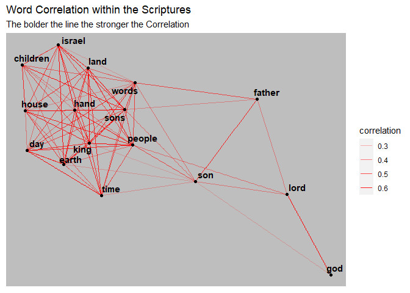

Word Association in the Scriptures
================
Kit Applegate
2023-06-25

``` r
library(tidyverse)
library(tidytext)
library(widyr)
library(igraph)
library(ggraph)
library(scriptuRs)
library(tm)

lds_scriptures <- lds_scriptures()

kingJamesStopwords <- c("and", "thee", "thou", "ye", "art", "hast", "didst", "shalt", "hath", "thine", "thy", "yea", "saith", "pass", "behold")
```

``` r
book.Text <- lds_scriptures %>%
  select(volume_title,book_long_title, text)
  
book.Words <- book.Text %>%
  unnest_tokens(output = word, input = text) %>%
  anti_join(stop_words, by = "word") %>%
  filter(str_detect(word, "[:alpha:]"))

book.Words <- book.Words %>%
  filter(!word %in% kingJamesStopwords)
```

``` r
book.Words %>%
  group_by(book_long_title) %>%
  summarise(Total.Words = n()) %>%
  arrange(desc(Total.Words))
```

    ## # A tibble: 87 × 2
    ##    book_long_title                         Total.Words
    ##    <chr>                                         <int>
    ##  1 The Doctrine and Covenants                    32869
    ##  2 The Book of Alma                              23370
    ##  3 The Book of Psalms                            14161
    ##  4 The Book of the Prophet Jeremiah              13057
    ##  5 The First Book of Moses called Genesis        11742
    ##  6 The Book of the Prophet Isaiah                11654
    ##  7 The Book of the Prophet Ezekiel               11569
    ##  8 The Fourth Book of Moses called Numbers       10839
    ##  9 The Second Book of Moses called Exodus        10098
    ## 10 The Second Book of the Chronicles              8799
    ## # ℹ 77 more rows

``` r
book.Words.mentioned <- book.Words %>%
  count(word, name = "book_long_title") %>%
  filter(book_long_title >= 1300)

word.Correlations <- book.Words %>%
  semi_join(book.Words.mentioned, by = "word") %>%
  pairwise_cor(item = word, feature = book_long_title) %>%
  filter(correlation >= .2)
```

``` r
set.seed(421)
graph_from_data_frame(
  d = word.Correlations, 
  vertices = book.Words.mentioned %>%
    semi_join(word.Correlations, by = c("word" = "item1"))
) %>%
  ggraph(layout = "fr") +
  geom_edge_link(aes(alpha = correlation), size = 1.7, color = "red") +  # Apply color gradient based on correlation
  geom_node_point() +
  geom_node_text(aes(label = name, fontface = "bold"), repel = TRUE) +
  guides(color = "none") +
  labs(title = "Word Correlation within the Scriptures", 
       subtitle = "The bolder the line the stronger the Correlation") +
  theme(panel.background = element_rect(fill = "gray"))
```

    ## Warning in geom_edge_link(aes(alpha = correlation), size = 1.7, color = "red"):
    ## Ignoring unknown parameters: `edge_size`

    ## Warning: Using the `size` aesthetic in this geom was deprecated in ggplot2 3.4.0.
    ## ℹ Please use `linewidth` in the `default_aes` field and elsewhere instead.
    ## This warning is displayed once every 8 hours.
    ## Call `lifecycle::last_lifecycle_warnings()` to see where this warning was
    ## generated.

<!-- -->
